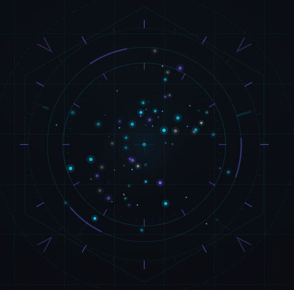

<p align="center">
  
</p>

<h1 align="center">ZeroJarvis</h1>

<p align="center">
  <strong>開口即用的 AI 語音助理 — 零打字、零按鈕、零等待</strong>
</p>

<p align="center">
  語音驅動 · 視覺分析 · 地圖導航 · 餐廳訂位 · 筆記查詢<br/>
  基於 <a href="https://opencode.ai/">OpenCode</a> Agent 架構，搭配 <a href="https://skills.sh/">skills.sh</a> 社群技能生態系
</p>

<p align="center">
  <a href="LICENSE"></a>
  <a href="https://opencode.ai/"></a>
  <a href="https://skills.sh/"></a>
  <a href="https://nodejs.org/"></a>
  <a href="https://pnpm.io/"></a>
</p>

---

## 它能做什麼？

打開頁面，直接說話 — 不需要任何按鈕：

| 你說的話 | Jarvis 做的事 |
|---------|--------------|
| 「附近有什麼好吃的」 | 🗺️ 搜尋餐廳評分 → 彈出地圖 → 語音介紹 |
| 「幫我訂湯棧，兩位，今晚七點」 | 🍽️ OpenTable 全自動訂位（含簡訊驗證） |
| 「開攝像頭拍照分析」 | 📷 全螢幕科幻相機 → Vision AI 圖像分析 |
| 「幫我看螢幕上這個錯誤」 | 🖥️ 框選截圖 + 標註 → AI 視覺分析 |
| 「筆記本裡有什麼關於 RAG 的內容」 | 📓 查詢 Google NotebookLM → 帶引用回覆 |
| 「新對話」「上一個」「下一個」 | 💬 無上限平行多會話管理 |
| 「安靜一下」 | 🔇 AI 自動暫停聆聽 |
| 「30 秒後提醒我開會」 | ⏰ 定時排程 → 時間到語音通知 |
| 「幫我比較三間日式餐廳」 | 🔄 背景任務執行 → 完成後語音報告 |
| 「我不吃辣」 | 🧠 持久記憶 → 下次推薦餐廳自動排除辣味 |

> **設計哲學**：所有互動都從語音開始，AI 透過 `[ACTION]` 標記主動控制前端 UI（攝像頭、地圖、截圖工具等），而非被動等待使用者操作。

## 特色

- **🎙️ 零操作語音互動** — 頁面載入即自動聆聽，VAD 偵測語音活動，無需喚醒詞
- **🤖 AI Agent 架構** — 基於 [OpenCode](https://opencode.ai/) Server，具備工具呼叫、多輪對話、上下文記憶
- **🎯 ACTION 控制系統** — AI 在回覆中嵌入控制標記，主動驅動前端 UI
- **🧩 Skill 驅動行為** — 所有 AI 行為由 SKILL.md 定義，支援 [skills.sh](https://skills.sh/) 社群技能
- **💬 多會話管理** — 無上限平行對話，語音切換，背景處理完成通知
- **⏰ 背景任務** — AI 自動判斷耗時操作派到背景，秒/分/時/日/週/月/年重複排程，任務面板可獨立刪除，完成後語音通知
- **🧠 跨對話記憶** — 持久化使用者偏好與事實，背景任務自動繼承記憶上下文，任務結果自動持久化
- **📷 視覺分析** — 攝像頭拍照 + 螢幕截圖，送 Vision Agent 分析
- **🗺️ 地圖導航** — AI 推薦地點後自動彈出 Google Maps
- **🍽️ 餐廳訂位** — OpenTable 全自動化（MCP Server + Playwright CDP）
- **📓 NotebookLM** — 查詢筆記本、產生 Podcast、測驗、心智圖
- **🖥️ 桌面應用** — Tauri 2.0 原生桌面版，支援 `Ctrl+Space` 全域喚醒

## 系統架構

```
                           使用者
                             │
                        語音 / 視覺
                             │
┌────────────────────────────▼────────────────────────────────┐
│                  前端 UI (SvelteKit + Tauri)                │
│   VAD (Silero) → 麥克風 │ 攝像頭 │ HUD 動畫 │ 字幕 │ 地圖     │
└──────────────────────┬──────┬───────────────────────────────┘
                       │ WS   │ WS
┌──────────────────────▼──────▼───────────────────────────────┐
│                 Voice Gateway (Bun + Hono)                  │
│   Gateway:  STT (Groq) │ TTS (edge-tts) │ Session │ Task │ Memory  │
└──────────────────────────┬──────────────────────────────────┘
                           │ HTTP/SSE
┌──────────────────────────▼──────────────────────────────────┐
│                   OpenCode Server (Agent)                   │
│   LLM (Claude) │ bash/CLI │ MCP │ Skills │ Vision           │
│                        │                                    │
│                  ┌─────▼─────────────────┐                  │
│                  │  MCP: food-search      │                 │
│                  │  Playwright CDP → Chrome│                │
│                  └───────────────────────┘                  │
└─────────────────────────────────────────────────────────────┘
```

## 快速開始

### 前置需求

| 工具 | 版本 | 用途 |
|------|------|------|
| [Node.js](https://nodejs.org/) | ≥ 20 | 執行環境 |
| [pnpm](https://pnpm.io/) | ≥ 9 | 套件管理 |
| [Bun](https://bun.sh/) | ≥ 1.1 | Gateway Server |
| [OpenCode](https://opencode.ai/) | 最新 | LLM Agent |
| [Rust](https://rustup.rs/) | 最新 | Desktop 版（Web 版不需要） |

<details>
<summary><strong>選用工具（依功能需求）</strong></summary>

| 工具 | 功能 |
|------|------|
| [uv](https://docs.astral.sh/uv/) | NotebookLM 整合需要 |
| [Google Chrome](https://www.google.com/chrome/) | OpenTable 訂位自動化需要 |

</details>

### 安裝

```bash
git clone https://github.com/user/ZeroJarvis.git
cd ZeroJarvis
pnpm install
```

### 設定

```bash
cp .env.example .env
```

編輯 `.env` 填入 API Key：

| 變數 | 必要性 | 取得方式 |
|------|--------|----------|
| `GROQ_API_KEY` | **必填** | [console.groq.com/keys](https://console.groq.com/keys)（免費） |
| `OPENCODE_URL` | 選填 | 預設 `http://localhost:4096` |
| `TTS_VOICE` | 選填 | 預設 `zh-TW-HsiaoChenNeural` |

### 啟動

```bash
# 一鍵啟動（Windows）
.\start.bat          # CMD
.\start.ps1          # PowerShell

# 或手動啟動三個服務
opencode serve                  # Agent Server :4096
pnpm --filter gateway dev       # Voice Gateway :3100
pnpm --filter web dev           # Web UI :3000
```

開啟 **https://localhost:3000** → 允許麥克風權限 → 直接說話

<details>
<summary><strong>Desktop 版（Tauri 桌面應用）</strong></summary>

```bash
.\start-desktop.bat    # 需要 Rust
```

- 首次編譯約 2-3 分鐘，後續增量 build 很快
- 支援 `Ctrl+Space` 全域快捷鍵喚醒視窗
- 原生螢幕截圖（無需用戶確認）

</details>

### 首次使用

1. 終端執行 `opencode` → `/connect` 設定 LLM provider（建議 GitHub Copilot 或 Anthropic）
2. 瀏覽器開啟 → 允許麥克風 → 直接說話

## 專案結構

```
ZeroJarvis/
├── apps/
│   ├── web/                   # SvelteKit 前端 (HUD UI)         :3000
│   └── desktop/               # Tauri 桌面應用 (Rust + Web)
├── services/
│   └── gateway/               # Bun WebSocket 語音閘道           :3100
│       └── src/
│           ├── food/          # OpenTable MCP Server (CDP)
│           └── task/          # 背景任務 + 記憶系統
│               └── memory.ts  #   持久記憶 (files/memory/)
├── packages/
│   └── shared/                # 共用型別與常數
├── .opencode/
│   ├── agents/                # Agent 定義
│   │   ├── jarvis.md          #   主 Agent（語音助理）
│   │   └── vision.md          #   Vision 子 Agent
│   └── skills/                # 自訂技能（ZeroJarvis 專屬）
│       ├── hardware-control/  #   攝像頭控制
│       ├── food-map/          #   地圖導航 + 餐廳訂位
│       ├── screenshot/        #   螢幕截圖
│       ├── session/           #   多會話管理
│       ├── listen-control/    #   聆聽控制
│       └── notebooklm/        #   NotebookLM 整合
├── .agents/skills/            # 社群技能（skills.sh 安裝）
├── config/booking.json        # 訂位人資訊
├── files/
│   ├── memory/                # 持久記憶 (YAML frontmatter MD)
│   └── tasks/                 # 任務結果持久化 (JSON)
├── docs/DESIGN.md             # 完整設計文件
├── start.bat / start.ps1      # Web 版啟動
└── start-desktop.bat / .ps1   # Desktop 版啟動
```

## 語音流程

```
🎤 使用者說話
     │
     ▼
[VAD 偵測語音] ──→ [STT 轉文字 (Groq Whisper)]
                         │
                         ▼
                  [OpenCode Agent (LLM)]
                    │           │
              純文字回覆    [ACTION:X] 標記
                    │           │
                    ▼           ▼
               [TTS 語音]   前端自動執行
                    │     (開相機/截圖/開地圖)
                    ▼
               🔊 語音回覆
```

## ACTION 系統

AI 在回覆中嵌入 ACTION 標記來主動控制前端，標記會被自動移除不朗讀：

| 標記 | 效果 |
|------|------|
| `[ACTION:CAMERA_ON]` / `OFF` | 開啟 / 關閉攝像頭 |
| `[ACTION:CAPTURE]` | 擷取攝像頭畫面 → Vision 分析 |
| `[ACTION:SCREENSHOT]` | 擷取電腦螢幕 → Vision 分析 |
| `[ACTION:MAP:搜尋詞]` / `MAP_CLOSE` | 彈出 / 關閉 Google Maps |
| `[ACTION:NOTEBOOK:{json}]` / `NOTEBOOK_CLOSE` | 顯示 / 關閉 NotebookLM 內容 |
| `[ACTION:NEW_SESSION]` | 建立新對話 |
| `[ACTION:SESSION_PREV]` / `NEXT` | 切換對話 |
| `[ACTION:LISTEN_PAUSE]` / `RESUME` | 暫停 / 恢復聆聽 |

### 背景任務標記

AI 回覆中嵌入任務標記，由 Gateway 解析後派發執行：

| 標記 | 效果 |
|------|------|
| `[ASYNC_TASK:描述]` | 立即派發背景 worker 執行 |
| `[SCHEDULE:ISO時間:描述]` | 指定時間觸發執行 |
| `[SCHEDULE_REPEAT:頻率:HH:mm:描述]` | 重複排程（`5s`/`1m`/`2h`/`daily`/`weekly`/`monthly`/`yearly`） |

### 記憶標記

AI 發現值得記住的資訊時，在回覆中嵌入記憶標記，自動儲存到持久記憶：

| 標記 | 效果 |
|------|------|
| `[MEMORY:名稱:類型:內容]` | 儲存到 `files/memory/` 持久記憶 |

類型：`user`（使用者偏好）、`project`（環境事實）、`task-history`（任務結果）、`reference`（參考資訊）

<details>
<summary><strong>如何擴充 ACTION</strong></summary>

1. 撰寫 `.opencode/skills/新功能/SKILL.md` — 教 AI 何時使用
2. `services/gateway/src/llm/opencode.ts` 的 `parseActions()` — 已支援任意 payload
3. `apps/web/src/lib/components/HUD.svelte` 的 `handleAction()` — 新增 case

</details>

## Skill 系統

Skills 是 SKILL.md 文件，定義 AI 在特定情境下的行為。OpenCode 自動從兩個路徑發現技能：

```
.opencode/skills/              ← 自訂技能（專案專屬）
├── hardware-control/          # 攝像頭控制
├── food-map/                  # 地圖 + 餐廳訂位 (MCP)
├── screenshot/                # 螢幕截圖
├── session/                   # 多會話管理
├── listen-control/            # 聆聽控制
└── notebooklm/                # NotebookLM 整合

.agents/skills/                ← 社群技能（skills.sh）
├── find-skills/               # 自動搜尋安裝新技能
├── skill-creator/             # 建立 / 改善 SKILL.md
├── mcp-builder/               # MCP Server 建構指南
├── claude-api/                # Claude API 最佳實踐
├── frontend-design/           # 前端 UI 設計
├── web-design-guidelines/     # UI/UX 審查
├── pdf/  docx/  xlsx/         # 文件處理
```

### 安裝社群技能

```bash
npx skills add <owner/repo> --skill <name> -a opencode -y
npx skills list        # 列出已安裝
npx skills find        # 互動式搜尋
npx skills update      # 更新全部
```

> 社群技能自動安裝到 `.agents/skills/`，與自訂技能互不干擾。

## 技術棧

| 層級 | 技術 | 說明 |
|------|------|------|
| **前端** | SvelteKit 2 + Svelte 5 (Runes) | 科幻 HUD 介面 |
| **桌面** | Tauri 2.0 (Rust) | 跨平台桌面應用 |
| **閘道** | Bun + Hono + WebSocket | 語音串流處理 |
| **VAD** | @ricky0123/vad-web (Silero ONNX) | 瀏覽器端語音偵測 |
| **STT** | Groq Whisper API | 快速中文語音辨識 |
| **TTS** | edge-tts | 免費、低延遲語音合成 |
| **LLM** | OpenCode + Claude Sonnet | Agent Loop + 工具呼叫 |
| **MCP** | food-search (Playwright CDP) | 餐廳搜尋 + 自動訂位 |
| **Monorepo** | pnpm workspace | apps/ + services/ + packages/ |

## 開發

```bash
pnpm install               # 安裝依賴
pnpm dev                   # 開發模式（全服務 hot reload）
pnpm --filter web dev      # 只跑前端
pnpm --filter gateway dev  # 只跑 Gateway
pnpm --filter web check    # 型別檢查
```

### 新增功能的流程

1. 撰寫 `.opencode/skills/新功能/SKILL.md` — 定義 AI 行為與 ACTION 標記
2. 若需前端互動 → `HUD.svelte` 的 `handleAction()` 新增 case
3. 若需新 overlay → 建立 `apps/web/src/lib/components/NewOverlay.svelte`
4. 若需外部 API → 建立 MCP Server 或使用 `bash` 工具

## 疑難排解

<details>
<summary><strong>常見問題</strong></summary>

| 問題 | 解法 |
|------|------|
| 麥克風沒反應 | 確認使用 HTTPS，並允許麥克風權限 |
| AI 沒回覆 | 確認 `opencode serve` 正在運行 |
| STT 失敗 | 確認 `.env` 中 `GROQ_API_KEY` 正確 |
| TTS 沒聲音 | 點擊頁面任意處解鎖 AudioContext |
| WebSocket 斷線 | Gateway 會自動重連，確認 port 3100 沒被佔用 |
| `cargo not found` | 安裝 [Rust](https://rustup.rs/)，重開終端 |
| 首次 Desktop 很慢 | 正常，Rust 編譯約 2-3 分鐘 |
| OpenTable 訂位卡住 | 確認 Chrome 未在其他地方開啟 CDP port 9234 |

</details>

## 貢獻

歡迎提交 Pull Request！請參閱 [CONTRIBUTING.md](CONTRIBUTING.md) 了解開發規範。

1. Fork 本專案
2. 建立功能分支 (`git checkout -b feature/amazing-feature`)
3. 提交變更 (`git commit -m 'feat: add amazing feature'`)
4. 推送分支 (`git push origin feature/amazing-feature`)
5. 開啟 Pull Request

## 授權

[MIT License](LICENSE) © 2026 ZeroJarvis
